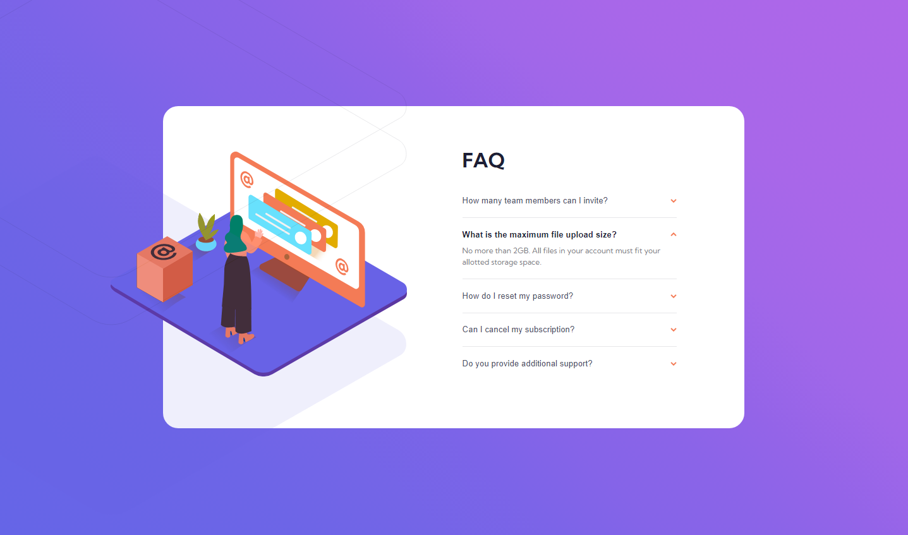

# Frontend Mentor - FAQ accordion card solution

This is a solution to the [FAQ accordion card challenge on Frontend Mentor](https://www.frontendmentor.io/challenges/faq-accordion-card-XlyjD0Oam). Frontend Mentor challenges help you improve your coding skills by building realistic projects. 

## Table of contents

- [Overview](#overview)
  - [The challenge](#the-challenge)
  - [Screenshot](#screenshot)
  - [Links](#links)
  - [Built with](#built-with)
  - [What I learned](#what-i-learned)
  - [Continued development](#continued-development)
- [Author](#author)

**Note: Delete this note and update the table of contents based on what sections you keep.**

## Overview

### The challenge

Users should be able to:

- View the optimal layout for the component depending on their device's screen size
- See hover states for all interactive elements on the page
- Hide/Show the answer to a question when the question is clicked

### Screenshot

### Links

- Solution URL: [Add solution URL here](https://github.com/victorsonet/victorsonet.github.io)
- Live Site URL: [Add live site URL here](https://victorsonet.github.io/)

## My process

### Built with

- Semantic HTML5 markup
- CSS custom properties
- CSS Grid
- Mobile-first workflow
- JavaScript

### What I learned

I learned how to do the collapsible list.

### Continued development

JavaScript things.

## Author

- Website - [Viktor Kovács](https://victorsonet.github.io/)
- Frontend Mentor - [@victorsonet](https://www.frontendmentor.io/profile/victorsonet)
- Twitter - [@GMLvictorsoN](https://www.twitter.com/GMLvictorsoN)